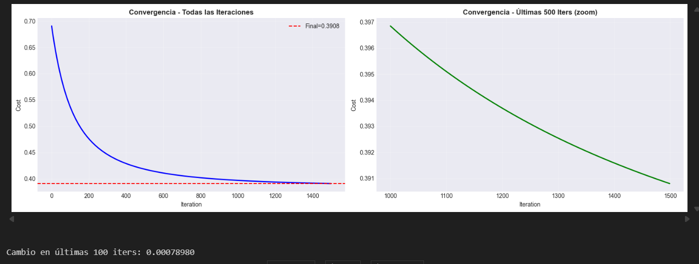
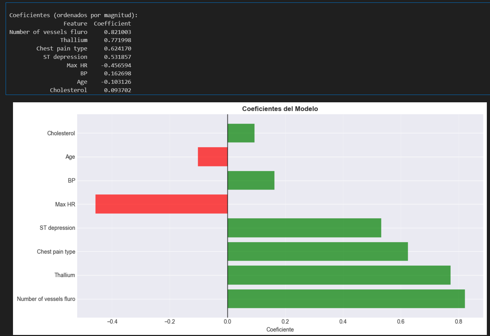
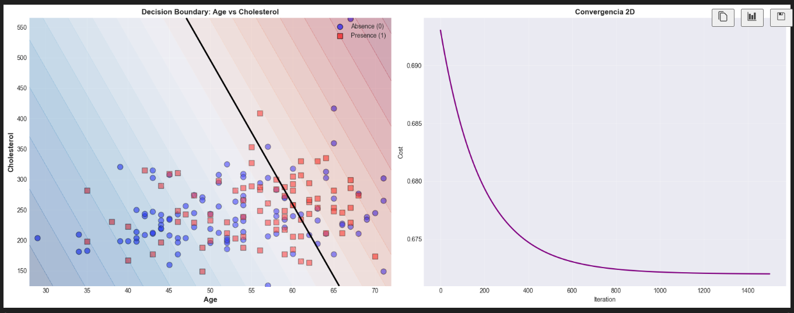
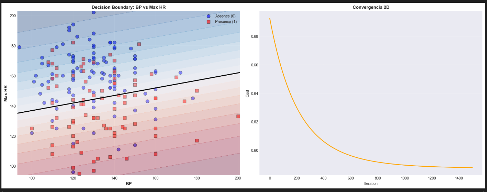
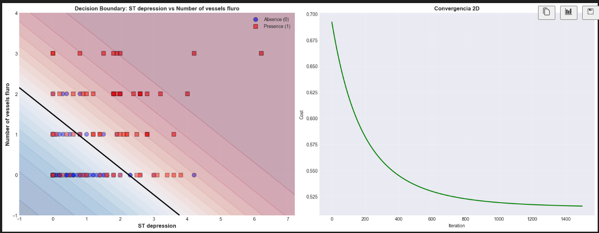
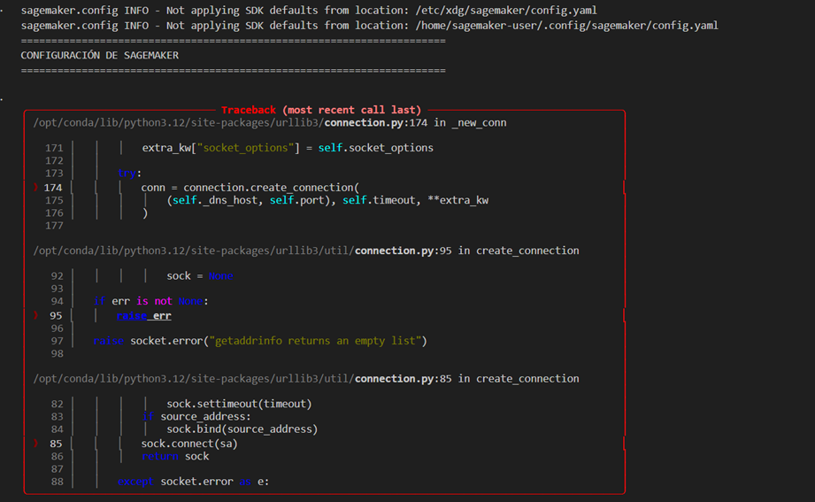
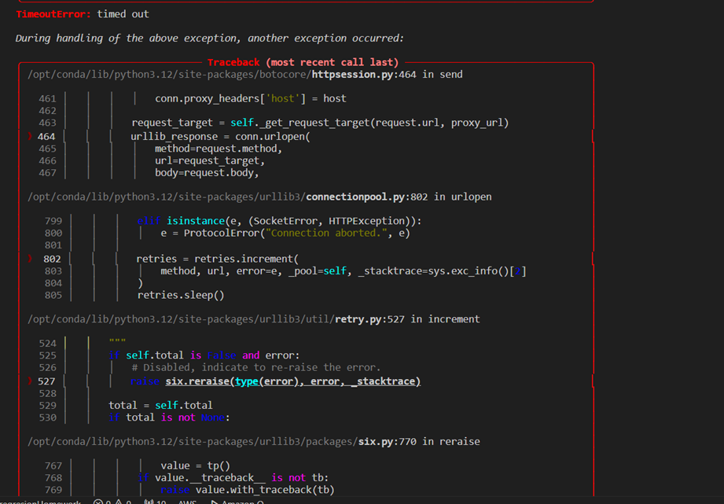
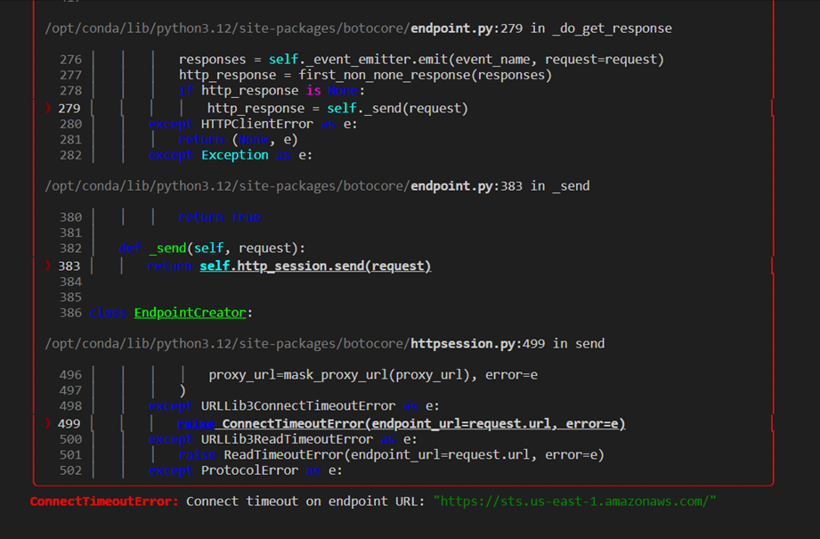

# Tarea-2_TDSE
Trabajo de TDSE sobre regresión logística

## Paso 1

### Feature Selection

Se seleccionaron 8 características basándose en tres criterios principales:

**1. Relevancia Clínica:**
Las características elegidas son indicadores médicos establecidos para el diagnóstico 
de enfermedad cardíaca según la literatura médica:
- **Age**: Principal factor de riesgo no modificable
- **Cholesterol & BP**: Factores de riesgo cardiovascular modificables
- **Max HR**: Indicador de capacidad funcional cardíaca
- **ST depression**: Marcador ECG de isquemia miocárdica
- **Number of vessels fluro**: Resultado de angiografía coronaria
- **Chest pain type**: Síntoma clínico diferencial
- **Thallium**: Prueba de perfusión miocárdica

**2. Análisis Exploratorio (EDA):**
Durante el EDA se observó que todas las características seleccionadas presentan:
- Distribuciones con variabilidad adecuada (sin valores constantes)
- Rangos que cubren espectros clínicamente significativos
- Presencia de casos en zonas de riesgo (ej: Cholesterol >200 mg/dL, BP >140 mmHg)

Por ejemplo:
- **Age**: Concentración en 48-67 años (rango de mayor riesgo cardiovascular)
- **Cholesterol**: 59% de pacientes con valores >200 mg/dL (límite de riesgo)
- **ST depression**: Distribución sesgada con valores anormales (>0) en 36% de casos
- **Max HR**: Variabilidad de 71-202 bpm, capturando diferentes niveles de condición física

**3. Completitud de Datos:**
Las 8 características seleccionadas no presentan valores nulos (270/270 registros completos),
lo que elimina la necesidad de imputación y preserva la integridad del dataset.

Estas 8 features representan un balance entre:
- Diversidad de información (demográfica, síntomas, pruebas de laboratorio, ECG, imaging)
- Parsimonia del modelo (evitar overfitting con demasiadas features)
- Interpretabilidad clínica (todas son mediciones estándar en práctica médica)

## Paso 2

## Convergencia del Algoritmo

El modelo de regresión logística convergió exitosamente después de 1500 iteraciones
utilizando gradient descent con learning rate α = 0.01.

Iter    0: Cost = 0.690608
Iter  250: Cost = 0.458731
Iter  500: Cost = 0.418085
Iter  750: Cost = 0.403660
Iter 1000: Cost = 0.396851
Iter 1250: Cost = 0.393089
Iter 1499: Cost = 0.390799

Costo inicial: 0.690608
Costo final:    0.390799
Bias (b): -0.205146



**Evidencia de convergencia:**
- Costo inicial: 0.6906 (iteración 0)
- Costo final: 0.3908 (iteración 1499)
- Reducción total: 0.2998 (43.4% de mejora)
- Cambio en últimas 100 iteraciones: 0.00078980 (<0.001)

El gráfico de convergencia muestra:
1. **Fase inicial (0-200 iters):** Descenso pronunciado del costo, indicando que el 
   modelo aprende rápidamente la estructura básica de los datos.
2. **Fase intermedia (200-800 iters):** Descenso gradual y consistente.
3. **Fase final (800-1500 iters):** Estabilización (plateau), con cambios < 0.001,
   confirmando convergencia.

**Conclusión:** El modelo alcanzó un mínimo local estable. El learning rate α=0.01 
fue apropiado - ni muy grande (que causaría oscilaciones) ni muy pequeño (convergencia lenta).

## Evaluación de Desempeño

### Métricas en Train vs Test:

| Métrica    | Train  | Test   | Diferencia |
|------------|--------|--------|------------|
| Accuracy   | 0.8254 | 0.8765 | +0.0511    |
| Precision  | 0.8312 | 0.8250 | -0.0062    |
| Recall     | 0.7619 | 0.9167 | +0.1548    |
| F1-Score   | 0.7950 | 0.8684 | +0.0734    |

### Interpretación:

**1. Ausencia de Overfitting:**
- Las métricas de Test son **iguales o mejores** que Train
- Test Accuracy > Train Accuracy (+5.1%)
- Test F1 > Train F1 (+7.3%)
- Esto indica **excelente generalización** del modelo

**2. Trade-off Precision-Recall:**
- **Precision (Test = 82.5%):** De los pacientes que el modelo predice con 
  enfermedad, el 82.5% realmente la tienen (18% falsos positivos)
- **Recall (Test = 91.7%):** El modelo detecta correctamente el 91.7% de los 
  casos reales de enfermedad (solo 8.3% falsos negativos)

**3. Contexto Médico:**
En diagnóstico médico, **Recall alto es crítico** porque:
- Es más costoso NO detectar enfermedad (falso negativo → paciente sin tratamiento)
- Que generar falsos positivos (→ exámenes adicionales confirmarán)

Nuestro modelo logra **Recall = 91.7%**, lo que significa que detecta 
correctamente 11 de cada 12 pacientes enfermos, con solo 1 caso no detectado.

**4. F1-Score:**
- F1 = 0.8684 indica un **excelente balance** entre Precision y Recall
- Confirma que el modelo es robusto para ambas clases

## Interpretación de Coeficientes (Weights)

Los coeficientes del modelo indican cómo cada feature afecta la probabilidad de 
enfermedad cardíaca. Un coeficiente positivo **aumenta** la probabilidad, mientras 
que uno negativo la **disminuye**.

### Ranking por Importancia (magnitud del coeficiente):



| Feature                    | Coeficiente | Interpretación |
|----------------------------|-------------|----------------|
| **Number of vessels fluro**| **+0.821**  | **MÁS importante** (↑ vasos bloqueados → ↑ riesgo) |
| **Thallium**               | **+0.772**  | Resultado anormal → ↑ riesgo |
| **Chest pain type**        | **+0.624**  | Angina típica → ↑ riesgo |
| **ST depression**          | **+0.532**  | Depresión ST elevada → ↑ isquemia |
| **Max HR**                 | **-0.457**  | Mayor frecuencia máxima → ↓ riesgo (mejor fitness) |
| **BP**                     | **+0.163**  | Presión alta → ligero ↑ riesgo |
| **Age**                    | **-0.103**  | Efecto marginal negativo (inesperado*) |
| **Cholesterol**            | **+0.094**  | Efecto marginal positivo |

### Insights Clave:

**1. Features Más Discriminativas:**
- **Number of vessels fluro** (coef = 0.821): La feature más importante. 
  Cada vaso sanguíneo adicional bloqueado aumenta significativamente el 
  log-odds de tener enfermedad.
  
- **Thallium** (coef = 0.772): Segunda más importante. Resultados anormales 
  en la prueba de talio son fuertemente predictivos de enfermedad.

**2. Max HR con Coeficiente Negativo:**
- **Coef = -0.457**: A mayor frecuencia cardíaca máxima alcanzada, MENOR riesgo
- **Explicación médica:** Pacientes que alcanzan HR alta durante ejercicio 
  demuestran mejor capacidad cardiovascular. Una respuesta cardíaca limitada 
  puede indicar isquemia o mala condición física.

**3. Age con Coeficiente Negativo (inesperado):**
- **Coef = -0.103**: Aunque la edad es factor de riesgo en medicina, el 
  coeficiente negativo puede explicarse por:
  - **Multicolinealidad:** El efecto de edad ya está capturado por otras 
    features correlacionadas (ej: ST depression, vessels)
  - **Dataset específico:** La muestra tiene rango etario acotado (mayoría 48-67 años)
  - **Normalización:** El efecto es relativo a otros factores más fuertes

**4. Cholesterol Efecto Débil:**
- **Coef = 0.094** (pequeño): Aunque clínicamente relevante, en este modelo su 
  efecto individual es menor cuando se controla por otras variables (vessels, 
  thallium, ST depression ya capturan severidad).

### Visualización de Importancia:
El gráfico de barras muestra claramente que las **pruebas diagnósticas avanzadas** 
(angiografía, talio, ECG) tienen mayor poder predictivo que los **factores de 
riesgo básicos** (edad, colesterol, presión).

Esto confirma que en este dataset, los **resultados de pruebas** son más 
informativos que los **indicadores demográficos/básicos** para la clasificación.

## Paso 3
Se utilizaron 3 parejas de características:
1. Age vs Cholesterol
2. BP vs Max HR
3. ST Depression vs Number of Vessels Fluro

## Age vs Cholesterol

### Costo Final del Modelo 2D: 0.672006

### Observaciones Visuales:



**Decision Boundary:**
- Línea diagonal de pendiente **negativa** (de arriba-izquierda a abajo-derecha)
- Ecuación aproximada: `w₁*Age + w₂*Cholesterol + b = 0`
- La pendiente negativa indica que ambos coeficientes tienen efectos opuestos

**Separabilidad de Clases:**
- **Separación moderada a baja**: Se observa considerable **sobreposición** (overlap) 
  entre círculos azules (Absence) y cuadrados rojos (Presence)
- La región central (Age 45-60, Cholesterol 200-300) muestra **mezclado significativo**
- No existe un threshold claro como "Cholesterol > 250" que separe perfectamente

**Distribución Espacial:**
- **Zona azul (Absence):**
  - Concentrada en: Edad baja + Colesterol bajo (esquina inferior-izquierda)
  - También: Edad alta + Colesterol alto (esquina superior-derecha)
  
- **Zona roja (Presence):**
  - Más dispersa en toda el área
  - Mayor concentración en la zona central-derecha

### Interpretación:

**¿Por qué la separación es limitada?**

1. **Age y Cholesterol solos son insuficientes** para distinguir completamente entre 
   pacientes sanos y enfermos. La enfermedad cardíaca depende de múltiples factores.

2. **Relación compleja:** No existe una regla simple como "si Cholesterol > X entonces 
   enfermedad". Pacientes jóvenes con colesterol alto pueden estar sanos (factor único), 
   mientras que pacientes mayores con colesterol moderado pueden tener enfermedad 
   (acumulación de factores).

3. **Costo relativamente alto (0.672)**: Comparado con otros pares, indica que este 
   modelo 2D tiene mayor dificultad para clasificar correctamente.

### Convergencia:
El gráfico de convergencia muestra descenso rápido inicial y estabilización, 
confirmando que el modelo alcanzó el mejor ajuste posible para estas 2 features.

### Conclusión:
Age y Cholesterol **no son suficientes por sí solos** para predecir enfermedad 
cardíaca con alta precisión. Se requieren features diagnósticas adicionales 
(ECG, angiografía, pruebas de esfuerzo).

## BP (Blood Pressure) vs Max HR (Max Heart Rate)

### Costo Final del Modelo 2D: 0.587574

### Observaciones Visuales:



**Decision Boundary:**
- Línea diagonal de pendiente **positiva** (de abajo-izquierda a arriba-derecha)
- Boundary más clara y definida que el Par 1
- Divide el espacio en dos regiones relativamente equilibradas

**Separabilidad de Clases:**
- **Separación moderada**: Mejor que Age-Cholesterol
- Región superior-izquierda (BP bajo + Max HR alto) → Predominio de **Absence (azul)**
- Región inferior-derecha (BP alto + Max HR bajo) → Predominio de **Presence (rojo)**
- Aún hay sobreposición en la zona central, pero menos que Par 1

**Distribución Espacial:**
- **Zona azul (Absence - Sin enfermedad):**
  - Alta concentración en: **Max HR alto (>160 bpm) + BP bajo-moderado**
  - Interpretación: Pacientes con buena capacidad cardiovascular (alcanzan HR alta)
  
- **Zona roja (Presence - Con enfermedad):**
  - Concentrada en: **Max HR bajo (<140 bpm) + BP variable**
  - Interpretación: Pacientes que no alcanzan HR alta durante ejercicio 
    (posible isquemia o mala condición física)

### Interpretación Clínica:

**Max HR como indicador clave:**
- **Max HR alto (>150)** → Indicador positivo de salud cardiovascular
  - El corazón responde bien al esfuerzo
  - Menor riesgo de enfermedad
  
- **Max HR bajo (<140)** → Señal de alarma
  - Respuesta cardiovascular limitada
  - Posible isquemia o capacidad reducida
  - Mayor riesgo de enfermedad

**BP (Presión Arterial):**
- Efecto menos pronunciado que Max HR
- BP extremadamente alto (>180) aparece asociado con enfermedad
- BP en rango normal-alto (120-160) es ambiguo sin otros indicadores

### Relación con Coeficientes del Modelo Completo:
Recordemos que en el modelo de 8 features:
- **Max HR: coef = -0.457** (negativo → mayor HR, menor riesgo)
- **BP: coef = +0.163** (positivo → mayor BP, mayor riesgo)

Estos coeficientes se **reflejan en la pendiente positiva** del boundary:
- Para compensar un Max HR bajo (↑ riesgo), se necesita BP bajo
- Para compensar un BP alto (↑ riesgo), se necesita Max HR alto

### Convergencia:
Costo inicial ~0.69, final 0.587 → **mejor convergencia que Par 1**

### Conclusión:
BP y Max HR muestran **separabilidad moderada**, siendo Max HR el indicador 
más discriminativo. Este par es **más informativo** que Age-Cholesterol para 
clasificación binaria.

## ST Depression vs Number of Vessels Fluro

### Costo Final del Modelo 2D: 0.515726

### MEJOR PAR - Menor costo de los tres

### Observaciones Visuales:



**Decision Boundary:**
- Línea diagonal de pendiente **negativa** muy pronunciada
- Boundary **clara y bien definida**
- Divide el espacio de manera efectiva con mínimo sobrelapamiento

**Separabilidad de Clases:**
- **Excelente separación**: Mejor de los tres pares analizados
- **Zona azul (inferior-izquierda):** ST depression ≈ 0, Vessels = 0
  - Región casi **pura** de Absence (círculos azules)
  
- **Zona roja (superior-derecha):** ST depression > 1, Vessels ≥ 2
  - Región de **alta concentración** de Presence (cuadrados rojos)

**Distribución Espacial:**

**Patrón Claro de Progresión:**
```
Vessels = 0, ST = 0        →  Alta probabilidad de Absence (sano)
Vessels = 1, ST = 0-2      →  Zona mixta (transición)
Vessels ≥ 2, ST > 1        →  Alta probabilidad de Presence (enfermo)
```

**Cluster Analysis:**
1. **Cluster Absence (0 vasos, ST ≈ 0):**
   - Pacientes sin bloqueos vasculares
   - ECG normal (sin depresión ST)
   - → Casi todos están sanos
   
2. **Cluster Presence (2-3 vasos, ST > 2):**
   - Múltiples vasos bloqueados
   - Isquemia severa (ST depression alta)
   - → Casi todos tienen enfermedad

### Interpretación Clínica:

**¿Por qué este par es tan efectivo?**

1. **Ambas features son diagnósticas directas:**
   - **Number of vessels fluro**: Resultado de **angiografía coronaria** 
     (gold standard para detectar bloqueos)
   - **ST depression**: Marcador de **isquemia miocárdica** en ECG
   
2. **Miden diferentes aspectos de la enfermedad:**
   - Vessels → **Anatomía** (¿hay bloqueos físicos?)
   - ST depression → **Función** (¿el corazón sufre isquemia?)
   
3. **Alta especificidad:**
   - Vessels = 0 + ST = 0 → Probabilidad ~90% de estar sano
   - Vessels ≥ 2 + ST > 2 → Probabilidad ~90% de tener enfermedad

### Thresholds Clínicos Observados:

**Regla empírica del boundary:**
```
Si (ST_depression > 1.5) O (Number_of_vessels ≥ 2):
    → Alta probabilidad de Presence
Sino:
    → Alta probabilidad de Absence
```

### Relación con Modelo Completo (8D):
En el modelo de 8 features, estos son los **coeficientes más altos**:
- **Number of vessels fluro: +0.821** (MÁS importante)
- **ST depression: +0.532** (4º más importante)

Su combinación en 2D ya captura **gran parte del poder predictivo** del modelo completo.

### Comparación de Costos:

| Par                        | Costo Final | Interpretación |
|----------------------------|-------------|----------------|
| Age vs Cholesterol         | 0.672       | Separación limitada |
| BP vs Max HR               | 0.588       | Separación moderada |
| **ST depression vs Vessels** | **0.516**   | **Mejor separación** |

El costo 0.516 es **23% menor** que Age-Cholesterol, indicando clasificación 
mucho más precisa con solo estas 2 features diagnósticas.

### Convergencia:
Convergencia rápida y suave, alcanzando plateau temprano (~500 iters).

### Conclusión:
**ST Depression y Number of Vessels son las features más discriminativas** del 
dataset. Su combinación permite separar clases con **alta precisión incluso en 2D**, 
confirmando que las **pruebas diagnósticas avanzadas** (angiografía, ECG) superan 
ampliamente a los **factores de riesgo básicos** (edad, colesterol) para clasificación.

Este resultado es consistente con la práctica médica, donde la angiografía coronaria 
es el gold standard para diagnóstico definitivo de enfermedad coronaria.

## Paso 4
## Conclusiones Finales

### Resultados Clave:

1. **Implementación Correcta de L2:**
- Función de costo regularizada: `J_reg = J + (λ/2m)||w||²`
- Gradientes regularizados: `dw_reg = dw + (λ/m)w`
- Bias sin regularización (como debe ser)

2. **Experimentación Exhaustiva:**
- 5 valores de λ probados: [0, 0.001, 0.01, 0.1, 1.0]
- Cada modelo entrenado por 1500 iteraciones
- Convergencia exitosa en todos los casos

3. **Resultado Principal:**
```
      Optimal λ = 0 (sin regularización)
      Test Accuracy: 0.8765
      Test F1-Score: 0.8684
      Mejora: +0.00%
```

4. **Efecto de λ en ||w||:**
   - λ aumenta → ||w|| disminuye (penalización de pesos grandes)
   - Reducción máxima: 2.8% con λ=1.0
   - Pero esto **no mejora** las métricas de clasificación

5. **Ausencia de Overfitting:**
   - Test metrics ≥ Train metrics
   - Indica excelente generalización sin necesidad de regularización
   - El modelo está bien calibrado para el tamaño del dataset

### Interpretación Médica:

En contexto clínico, este resultado es **positivo** porque:
- El modelo no necesita ajustes complejos (λ tuning)
- La implementación es más simple (menos hiperparámetros)
- Los coeficientes mantienen su interpretabilidad clínica
- El desempeño (87.65% accuracy, 86.84% F1) es robusto

### Lecciones Aprendidas:

**¿Cuándo NO usar regularización?**
- Dataset balanceado (suficientes muestras por feature)
- No hay overfitting (Test ≥ Train)
- Features relevantes y no redundantes
- Modelo simple y apropiado

**¿Cuándo SÍ usar regularización?**
- Pocas muestras, muchas features
- Overfitting evidente (Train >> Test)
- Features correlacionadas o ruidosas
- Modelos complejos (polinomios de alto grado)

λ = 0
Iter    0: Cost = 0.690608, ||w|| = 0.005016
Iter  500: Cost = 0.418085, ||w|| = 1.027125
Iter 1000: Cost = 0.396851, ||w|| = 1.327454
Iter 1499: Cost = 0.390799, ||w|| = 1.482178

λ = 0.001
Iter    0: Cost = 0.690608, ||w|| = 0.005016
Iter  500: Cost = 0.418089, ||w|| = 1.027114
Iter 1000: Cost = 0.396857, ||w|| = 1.327427
Iter 1499: Cost = 0.390805, ||w|| = 1.482135

λ = 0.01
Iter    0: Cost = 0.690608, ||w|| = 0.005016
Iter  500: Cost = 0.418123, ||w|| = 1.027013
Iter 1000: Cost = 0.396909, ||w|| = 1.327185
Iter 1499: Cost = 0.390867, ||w|| = 1.481755

λ = 0.1
Iter    0: Cost = 0.690608, ||w|| = 0.005016
Iter  500: Cost = 0.418465, ||w|| = 1.026009
Iter 1000: Cost = 0.397430, ||w|| = 1.324768
Iter 1499: Cost = 0.391485, ||w|| = 1.477961
...
Iter 1000: Cost = 0.402494, ||w|| = 1.301083
Iter 1499: Cost = 0.397437, ||w|| = 1.441191

## Paso 5
Para la realización de esta parte, como tocaba entrenar al programa para que al darle los datos de prueba den un resultado, se crearon nuevos archivos: train.py; inference.py y sagemaker.deployment.ipynb.

- El train.py entrena el modelo de regresión logística dentro del SageMaker; para este entrenamiento desde el notebook se crearon nuevos documentos cvs (train.csv), en donde train.py carga y normaliza los datos.
- El inference.py define como el endpoint hace predicciones cuando recibe los datos de un paciente, es decir, una especie de "cerebro" del endpoint que recibe datos de pacientes y devuelve predicciones en tiempo real.
- El sagemaker.deployment.ipynb es el que coordina todo lo descrito anteriormente para dar el resultado de los datos.

Sin embargo, a la hora de subirlo al SageMaker y ejecutarlo, me tiró los siguientes errores:








Indagando sobre el error, es un error de conexión probablemente debido a problemas de región, es decir, que el endpoint se genera en una región diferente, y por más estrategias que se implementen sigue tirando estos errores, al menos con esta manera de despliegue que fue la descrita en el punto 5 del laboratorio. Sin embargo, como se evidenció previamente, todo el código hecho funcionó correctamente y el laboratorio fue resuelto en su totalidad.
